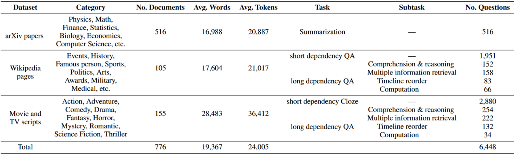

## 📜**Introduction**

**LooGLE** is a comprehensive evaluation benchmark for LLM long context understanding which contains up-to-date  (all after 2022) and extremely long realistic documents (over 24k tokens per document, many of which exceed 100k words) and 6,000 newly generated questions spanning diverse domains and categories. Details statistics of our dataset can be seen in the table below.

**Short and long dependency tasks**  LooGLE is composed of 7 major tasks to evaluate LLMs' ability to understand both short and long dependency content. We refer to ``long dependency" tasks as those that require the understanding of the inter-dependency across multiple shreds of evidence widely spanning over the entire long text. We delicately design 5 types of long dependency tasks, including comprehension and reasoning, computation, timeline reorder, multiple information retrieval, and summarization.

**Long context evaluation**  In order to provide more comprehensive and general results, LooGLE relies on automatic metrics based on semantic similarity, GPT4-as-judgment and human evaluation to get an overall performance for reference. We conducted the evaluation of 8 representative LLMs. We specifically select LLMs which have made great effort in addressing the challenge of understanding long contexts by utilizing flash attention, position interpolation, optimized Transformer and finetuning, external memory etc. 

LooGLE not only provides a systematic and comprehensive evaluation schema on long-context LLMs, but also sheds light on the future development of enhanced models toward “true long-context understanding”.

Github Repo for LongBench: https://github.com/bigai-nlco/LooGLE/

Arxiv Paper for LongBench: https://arxiv.org/abs/2311.04939


## 💁**How to use it?**

You can download and load the **LooGLE** data through the Hugging Face datasets ([🤗 HF Repo](https://huggingface.co/datasets/bigainlco/LooGLE)):

```python
from datasets import load_dataset

datasets = ["shortdep_qa", "shortdep_cloze", "longdep_qa", "longdep_summarization"]

for testset in datasets:
    data = load_dataset('bigainlco/LooGLE', testset, split='test')
    # evaluate your model
```


All data in **LooGLE** are standardized to the following format:
```json
{
    "input": "The original long input texts",
    "title": "The title of the given document",  //for arxiv paper, we use "title" to refer the identical ID for specific paper
    "qa_pairs":[
            {
                "Q": "Question to ask based on the given input",
                "A": "Groundtruth answer for the question",
                "S": [ "One or more evidence (complete sentences) for answering the question, which are extracted directly from the original input"
                ]
            },  
        ]        // There are multiple questions and corresponding answers in the list (each of them is in json format)
                 // For arxiv paper summarization, we use "none" instead for non-qa/non-cloze tasks
    "output": "none"   // the predicted outputs of LLM given the long input and instructions, which is initialized as "none"
```
To mention that, in long dependency QA data, we add an extra key `type` for each question in json to indicate the 4 types of long dependency tasks(apart from summarization).

## 📌 **Statistics of LooGLE**




## 📊**Evaluation**

This repository provides data download for LooGLE. If you wish to use this dataset for automated evaluation, please refer to our [github](https://github.com/bigai-nlco/LooGLE/).

## 📝 **Citation**
If you would like to use our data or find our work interesting, please cite:
```bibtex
@article{li2023loogle,
  title={LooGLE: Can Long-Context Language Models Understand Long Contexts?},
  author={Li, Jiaqi and Wang, Mengmeng and Zheng, Zilong and Zhang, Muhan},
  journal={arXiv preprint arXiv:2311.04939},
  year={2023}
}
```

## 📣 **Contacts**

We sincerely appreciate human annotators for their valuable contributions on creating high-quality long-dependency QA tasks.
We are very pleased to answer any questions about LooGLE: [nlp@bigai.ai](mailto:nlp@bigai.ai)

